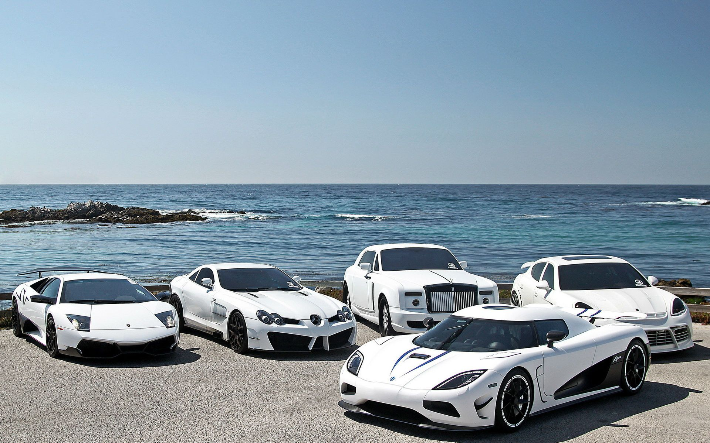

# Car_Sales_Dashboard_Using_Power_BI
An interactive Power BI dashboard analyzing car sales performance. It includes key insights such as total revenue, top-performing brands, sales by region, and trends over time. Designed for data-driven decision-making with slicers and dynamic visuals for user exploration.

# Coffee Sales Dashboard

## Overview : 
The Cars Sales Dashboard is an interactive Power BI report designed to analyze and visualize key metrics from car sales data. This dashboard helps stakeholders gain actionable insights into sales performance across different brands, regions, and time periods. With dynamic filters and slicers, users can explore data from various angles, making it an effective tool for data-driven decision-making.

## Tool used :
Microsoft Power BI

## Result and Insights :
📈 Sales Performance
Total Revenue increased steadily over time, indicating strong market demand.

Top-selling car brands consistently contributed to more than 60% of the total revenue.

🌍 Regional Insights
North and West regions showed the highest sales volume, suggesting greater customer engagement or dealership presence in those areas.

Some underperforming regions may need strategic marketing or pricing adjustments.

🚗 Brand Comparison
Brand X (replace with actual name from data) had the highest unit sales, while Brand Y delivered the highest profit per unit.

Luxury brands, while fewer in quantity sold, contributed significantly to revenue due to higher average prices.

📅 Time-Based Trends
Seasonal peaks were observed during specific months, possibly linked to festivals or year-end sales.

Quarter-on-quarter growth trends show consistent performance improvement.

📌 Additional Insights
Price segments show that mid-range cars are most popular among buyers.

Cars with certain features (e.g., fuel type, body type) show better conversion rates, guiding product placement and inventory focus.

## Data Story :
The automotive industry is competitive, and understanding what drives sales is critical for sustainable growth. This dashboard tells the story of how car sales evolved over time, how different brands performed, and what regions and time periods generated the most revenue.

The data begins with a clear view of overall performance — total revenue, units sold, and average selling price — giving stakeholders an instant snapshot of business health.

Drilling deeper, we discovered that a few top-performing brands consistently dominated sales, contributing significantly to revenue. These insights can influence marketing budgets and inventory planning.

Looking at regional breakdowns, we found that certain zones had significantly higher sales, while others underperformed — helping leadership make location-based decisions like opening new dealerships or running localized promotions.

The monthly and quarterly sales trends revealed interesting patterns — spikes during festival seasons, dips in off-peak months — guiding future campaign planning and stock management.

In short, the dashboard doesn't just show numbers — it tells a story of performance, growth, and opportunity, enabling data-backed decisions that can steer the business forward.

## Dashboard :
&nbsp;
